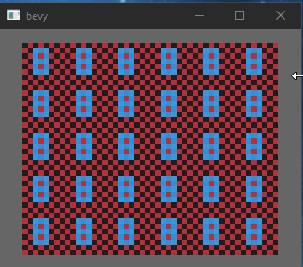

[](https://opensource.org/licenses/MIT)
[](https://crates.io/crates/bevy_tiled_camera)
[](https://docs.rs/bevy_tiled_camera/)

# `Bevy Tiled Camera`
A camera for properly displaying low resolution pixel perfect 2D games in bevy. It works by adjusting the viewport to match a target resolution, which is defined by a tile count and the number of pixels per tile.



## Example
```rust
use bevy_tiled_camera::*;
use bevy::prelude::*;

fn setup(mut commands:Commands) {
  // Sets up a camera to display 80 x 35 tiles.
  // Defaults to 8 pixels per tile with WorldSpace::Units.
  let camera_bundle = TiledCameraBundle::unit_cam([80,35]);
  commands.spawn_bundle(camera_bundle);
}
fn main() {
    App::new()
    .add_plugins((DefaultPlugins, TiledCameraPlugin))
    .add_systems(Startup, setup)
    .run();
}
```

# World Space
Your world space defines how transforms and scaling is treated in your game. You either position everything in terms of world units, or in terms of pixels. The camera supports either via it's `world_space` functions.

## Versions
| bevy | bevy_tiled_camera |
| --- | --- |
| 0.11 | 0.7.0 |
| 0.10 | 0.6.0 |
| 0.9 | 0.5.0 |
| 0.8 | 0.4.0 |
| 0.6 | 0.3.0 |
| 0.5 | 0.2.4 |
| 0.5 | 0.2.3 |

## Blurry sprites
By default bevy will create all new images with linear image sampling. This is good for smaller, high resolution images but causes severe blurriness with low resolution images. To fix it you can manually set the image sampler to nearest when creating your images, or change the default to always spawn new images with nearest sampling:

```rust
use bevy::{prelude::*, render::texture::ImageSettings};
use bevy_tiled_camera::*;

App::new()
    .add_plugins((DefaultPlugins.set(ImagePlugin::default_nearest()), TiledCameraPlugin))
    .run();
```
